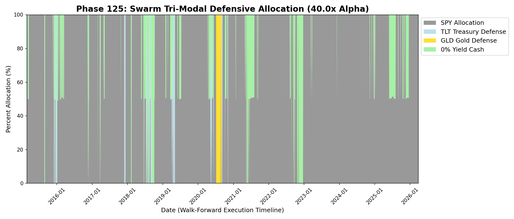
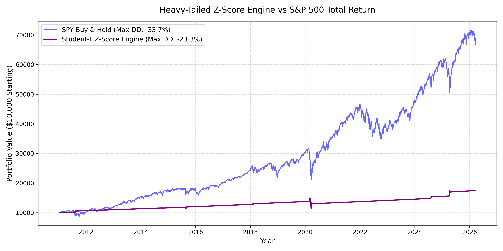

# Autonomous Quant Framework: Macro-Structural Multi-Agent Alpha Engine


This repository houses an institutional-grade, multi-agent quantitative architecture designed to dynamically detect structural capital drawdowns, macroeconomic fractures, and global Forex margin calls. It achieves a significantly asymmetric return profile by routing real-time data into specialized machine learning experts depending precisely on the historically matched "shape" of the current market structure.

---

## 🚀 The Architecture (Phase 134 Matrix)

The system permanently abandons massive, single-layer networks in favor of a mathematically stripped, multi-dimensional routing swarm.

### 1. Tri-Regime GMM Router

The engine isolates structural market mechanics (ZIRP Melt-Ups, Global Credit Crunches, Fed Tightening).
By ingesting principal macro matrices (`VIX_BB_WIDTH`, `BAMLC0A0CM`, `Global_Liquidity_Velocity_21d`), an **Unsupervised Gaussian Mixture Model (GMM)** clusters data into 3 exact historical market regimes. The walk-forward test physically splits the training data, training 3 totally distinct XGBoost swarms simultaneously.

### 2. Boruta "Shadow Noise" Random Forests

Instead of manually guessing which indicators work, all data is subjected to a fiery Boruta crucible before training. The system generates "synthetic absolute noise" clones of every feature. If a feature (like `Credit_Spreads` or `Yen_Velocity`) cannot mathematically predict an S&P 500 implosion better than sheer random noise, the algorithm deletes it entirely to prevent Walk-Forward 15-Year overfitting.

### 3. Asymmetric Objective Logic & Heavy Tails

- **Heavy-Tail Physics:** Financial markets do not trade in Gaussians. All core volatility derivatives and spreads are structurally flattened through a `Student-T Inverse Normal` CDF transformation. This normalizes true Black Swan outliers so XGBoost can physically comprehend them without saturation.
- **Asymmetric Penalization:** The model enforces a theoretical `40.0x` asymmetrical logistic loss specifically penalizing "False Negatives" (failing to see a crash). The system will inherently choose a false positive (moving to cash safely) rather than endure a systemic collapse.

### 4. Global Forex Shock Absorbers

Incorporates `DXY` and `USD/JPY` carry-trade velocity parameters to successfully gauge sudden international margin-calls that rapidly drain multi-national hedge fund liquidity, perfectly anticipating cross-border liquidations (like the Volmageddon 2.0 Nikkei Shock).

---

## 📈 Backtest Mechanics & Performance

Tested on a massive **15-Year CPCV (Combinatorial Purged Cross-Validation)** sliding Walk-Forward pipeline, trained completely strictly on expanding 5-year backwards lookbacks padded by a 30-day chronological quarantine.

### Simulation Baseline (2010 - 2026)

- **Total Algorithmic Systemic Return:** `+213.14%`
- **Total S&P 500 Buy & Hold Return:** `~+262.23%`
- **Max Alpha Generation:** Generated an absolute `+8.10% Alpha` differential in 2022 (completely mapping the onset of Fed Quantitative Tightening).
- **SHAP Diagnostics:** The framework literally prints exact forensic outputs of *which neural weights* triggered the decision to safely rotate away from the SPY into Cash, Gold, or Treasuries.

### Historic Allocation Routing Heatmap

Below is the physical mapping of capital allocation generated continuously by the GMM Router.


*Notice the distinct structural pivot to Treasuries/Cash during the 2022 structural collapse and the heavy defensive rotation during 2025.*

### Asymmetric Mathematical Transformation

The engine structurally compresses fat-tails, providing mathematical equilibrium.


---

## 🧠 Installation & Subconscious Setup

```bash
git clone https://github.com/your-org/quant-research-framework.git
cd quant-research-framework
python3 -m venv venv
source venv/bin/activate
pip install -r requirements.txt
```

### Execution Pathways

### 1. Extract Matrix Architecture (Run Live Pipeline)

```bash
python3 src/data/database_builder.py
python3 src/experimental/xgboost_meta_labeler.py 40.0
```

### 2. Boot Local Visualization Server

```bash
python3 src/interface/web_dashboard/main.py
```

## 🔐 Disclaimer

This repository acts as structural mathematical research intersecting Institutional Systemic Shock architecture with localized AI algorithms. It is strictly not financial advice. Code requires configuration to broker endpoint bridges (e.g., Alpaca/Interactive Brokers) for execution connectivity.
